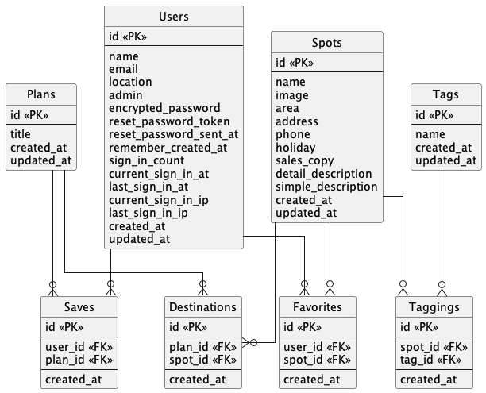
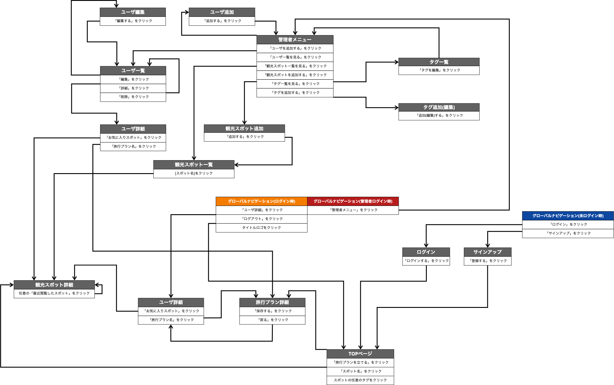

#### 開発言語
- Ruby 3.0.1
- Rails 6.1.7.3

#### 就業Termの技術
- devise
- お気に入り機能

#### カリキュラム外の技術
- Google Maps API

#### 実行手順
```
$git clone git@github.com:taknshno/chokkura.git
$cd chokkura
$bundle install
$yarn install
$rails db:create
$rails db:migrate
$rails s
```

#### カタログ設計
https://docs.google.com/spreadsheets/d/1QAJ1KlGOXCWAXqJjKshLusewHGwMOn74u3LTt2yxS-0/edit#gid=782464957

#### テーブル定義書

https://docs.google.com/spreadsheets/d/1QAJ1KlGOXCWAXqJjKshLusewHGwMOn74u3LTt2yxS-0/edit#gid=2020033787

#### ER図



#### 画面遷移図



#### ワイヤーフレーム

https://cacoo.com/diagrams/GTdJkWiZ6LwPbvWh/AAB77
